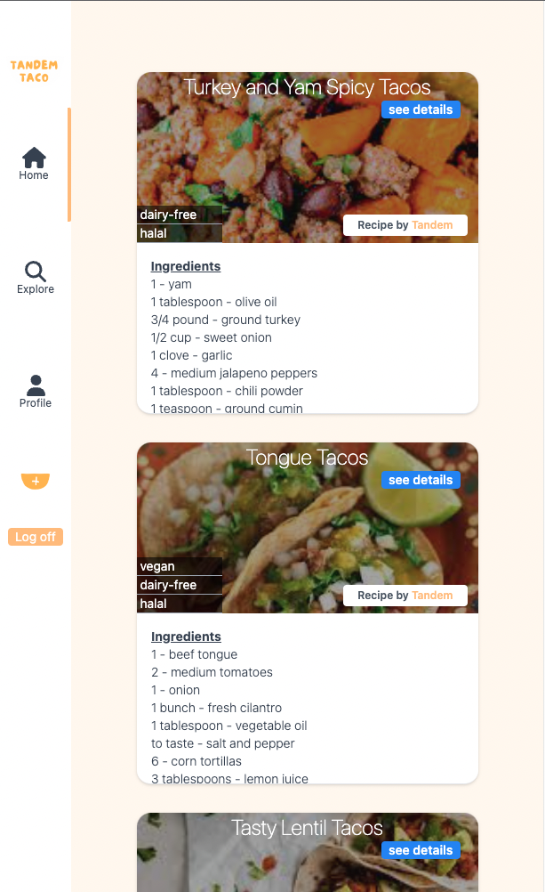

# Getting Started with Tando Taco Client

This project was bootstrapped with [Create React App](https://github.com/facebook/create-react-app), using the [Redux](https://redux.js.org/) and [Redux Toolkit](https://redux-toolkit.js.org/) TS template.

## Environment Setup for Tandem Taco Client

This project is the Client side of Tandem Taco. To get the client running, it is suggested to start the backend configuration and spin the server. Here is the link for the backend repo https://github.com/jayastronomic/tandem-tacos-server.

Cors is already set up for the client and backend to communicate through HTTP request.

Node version:

```
v.18.0.0
```

React version:

```
v18.2.0
```

To install the packages for this project, run the command:

```
npm install
```

To start the server and spin up Tandem Taco Client, run:

```
npm start
```

## Tech Stack

React w/ TypeScript <br/>
Tailwindcss <br/>
Redux ToolKit

## Introduction

Hey Tandem Team! Welcome to Tandem Taco, an application built to help you guys come up with new taco recipes.
As a user of this application, you have the ability to look at all of the taco recipes that have been added to the application. You can also create new taco recipes, so you can always share what crazy taco ideas you come up with. You have the ability to search for recipes by name, and filter the results by restrictions and the ingredients that are in the recipes. Users can view their recipes that they created and see the details of each recipe which shows the directions on how to cook and prepare the tacos.

## Tandem Taco User Flow

### WARNING

**_$${\colorI built this project with mobile first in mind, so it is best to minimize the browser window to get the best experience.Green}$$_**

When starting the server for the front-end, you will be automatically be redirected if you are not logged into the application. To use the application you must create an account:

[Tandem Taco Signup Page](./src/images/flow/SignUp-Flow.png)


After creating an account, you will land on the home page where you can view all of the taco recipes that have been created:

[Tandem Taco Home Page](./src/images/flow/Home.png)



The side navigation bar has 3 tab selections. To search and filter taco recipes click on the Explore tab. After clicking on the explore tab you will be navaigated to this page:

[Tandem Tcao Explore Page](./src/images/flow/Explore.png)


Here is where you can use the search bar to type in a recipe name. The recipe names will be highlighted to match the the text that is being typed in the search input. All searching is done in realtime, so the results will update as you are typing. To find more specific recipes by restrictions and ingredients, there two filtering tools to help you dwindle down on your results.

## Bonus Features

As a user, you can also create new taco recipes of your own. On the navigation bar, there is a button that resembles a taco with a plus sign on it that you can click to open up a modal to fill out a form to add a new recipe. You can add a photo, restrictions, ingedients, and directions on how to prepare your recipe.

[Add Taco Form](./src/images/flow/Form.png)


After adding your recipe, you can view the recipes you created on the profile page by clicking the the profile tab on the navigation bar. Each recipe card shows who created the recipe and also contains a link that will take you to the recipe's page showing more details about the recipe:

[Show Page](./src/images/flow/Show.png)


